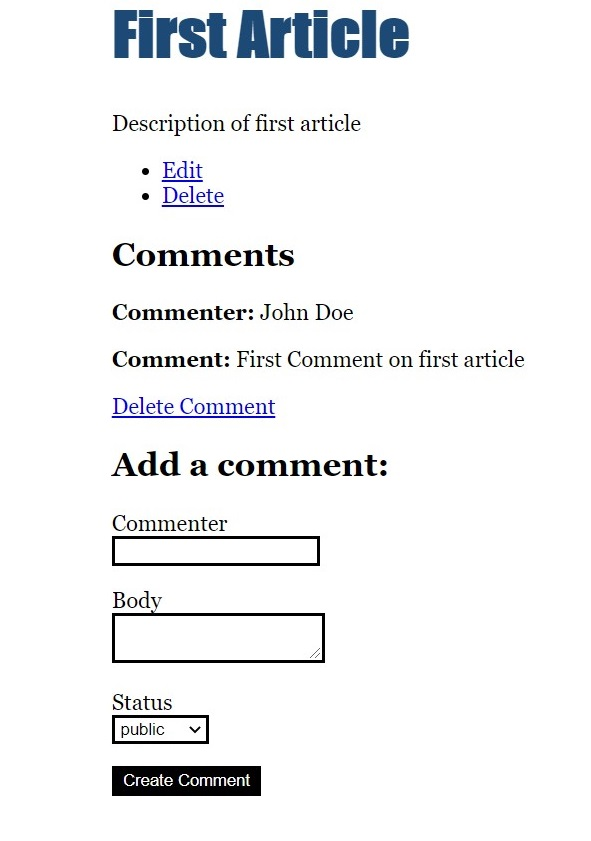

# MAUDLIN MANTA

A Rails Tutorial Blog Project. I created this while following the [official getting started guide](https://guides.rubyonrails.org/getting_started.html).

## Ruby version

I used 3.0.1. This information can also be found in .ruby-version file.

## Dependencies

1. Ruby
2. Rails
3. Yarn
4. SQLite3

## How to run

Clone the repository. Change working directory to cloned directory. Then run the following commands one by one -

```bash
yarn install

bins/rails db:migrate

bins/rails server
```

## Screenshots

Home page -


An article's detailed view -



An article's editing view -


